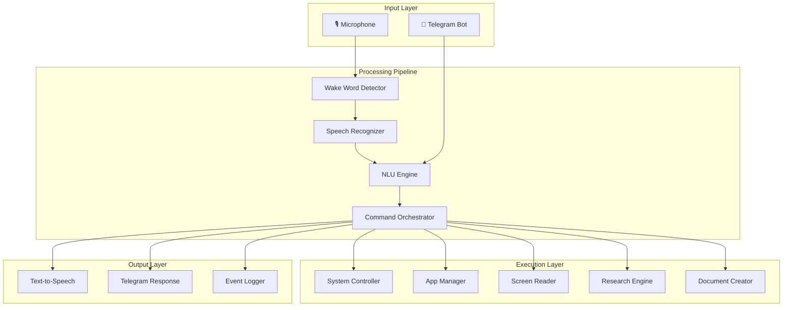
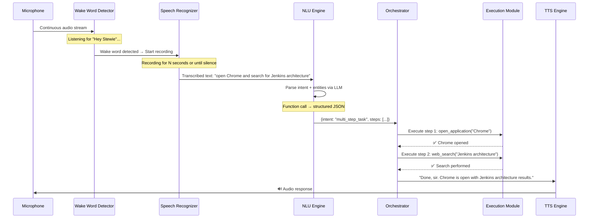
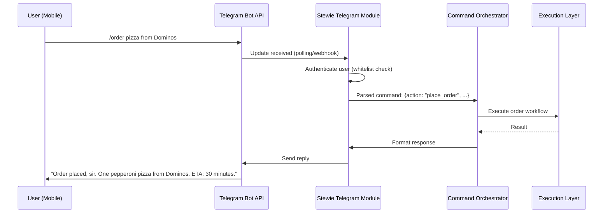

# Stewie — AI Assistant Architecture & Code Structure

> *"At your service, sir."*
>
> Stewie is a voice-controlled, JARVIS-inspired AI assistant built for Windows. It listens, understands, acts, and responds — with the polish and intelligence you'd expect from Stark Industries.

---

## Table of Contents

1. [High-Level Architecture](#1-high-level-architecture)
2. [Technology Stack](#2-technology-stack)
3. [Voice Command Flow](#3-voice-command-flow)
4. [Windows Integration Mechanisms](#4-windows-integration-mechanisms)
5. [Telegram Integration](#5-telegram-integration)
6. [Project Directory Structure](#6-project-directory-structure)
7. [Key Component Deep Dives](#7-key-component-deep-dives)
8. [Use Case Walkthrough](#8-use-case-walkthrough)
9. [Cross-Cutting Concerns](#9-cross-cutting-concerns)
10. [Future Roadmap](#10-future-roadmap)

---

## 1. High-Level Architecture

Stewie follows a **pipeline architecture** with a central orchestrator. Every voice or Telegram input flows through a deterministic chain of modules, each with a single responsibility.



### Module Interaction Summary

| Module | Inputs | Outputs | Dependencies |
|---|---|---|---|
| **Wake Word Detector** | Raw audio stream | Trigger signal | `pvporcupine` / `openwakeword` |
| **Speech Recognizer** | Triggered audio | Transcribed text | `faster-whisper` / Google STT |
| **NLU Engine** | Text (voice or Telegram) | Intents + Entities | OpenAI / local LLM |
| **Command Orchestrator** | Structured intent | Execution plan | All execution modules |
| **System Controller** | OS-level commands | Status confirmation | `ctypes`, `subprocess`, WMI |
| **App Manager** | App name/action | Launch/close status | `subprocess`, `psutil` |
| **Screen Reader** | Capture request | Text content / summary | `mss`, `pytesseract`, LLM |
| **Research Engine** | Search query | Structured findings | `requests`, search APIs, LLM |
| **Document Creator** | Content + format | Saved file path | `python-docx` |
| **TTS Engine** | Response text | Audio playback | `pyttsx3` / `edge-tts` |
| **Telegram Module** | Bot messages | Parsed commands / replies | `python-telegram-bot` |

---

## 2. Technology Stack

### Primary Language: **Python 3.11+**

**Justification:** Unmatched ecosystem for AI/ML, rapid prototyping, extensive Windows automation libraries, and first-class support from all major LLM providers.

### Core Libraries & Frameworks

| Category | Library | Purpose | Why This Choice |
|---|---|---|---|
| **Wake Word** | `openwakeword` | Offline wake word detection | Free, customizable, low-latency; no API key needed |
| **Speech Recognition** | `faster-whisper` | Local speech-to-text | OpenAI Whisper quality, 4x faster via CTranslate2; offline capable |
| **NLU / LLM** | `openai` (GPT-4o) | Intent parsing, summarization, research | Best-in-class reasoning; function-calling support for structured output |
| **NLU (Fallback)** | `ollama` + Llama 3 | Offline NLU when no internet | Privacy-first, no API costs, runs locally |
| **TTS** | `edge-tts` | Natural speech synthesis | Microsoft Edge voices — free, high quality, async streaming |
| **TTS (Fallback)** | `pyttsx3` | Offline TTS | SAPI5 integration, zero network dependency |
| **System Control** | `ctypes` + `subprocess` | Brightness, volume, power | Direct Windows API access; no third-party overhead |
| **Screen Brightness** | `screen_brightness_control` | Cross-monitor brightness | Abstracts WMI/DDC complexity |
| **Volume Control** | `pycaw` | Per-app and master volume | COM-based Windows Audio Session API |
| **App Management** | `psutil` + `subprocess` | Process listing, launch, kill | Cross-platform process management; lightweight |
| **Screen Reading** | `mss` + `pytesseract` | Screenshot + OCR | Fast screen capture; Tesseract is industry-standard OCR |
| **Screen Reading (Alt)** | `uiautomation` | Windows UI Automation API | Reads structured UI elements without OCR noise |
| **Document Creation** | `python-docx` | Word document generation | Pure Python, no Office installation needed for generation |
| **Web Research** | `requests` + `beautifulsoup4` | Web scraping | Lightweight, flexible HTML parsing |
| **Search API** | `duckduckgo-search` | Programmatic web search | No API key required; privacy-friendly |
| **Telegram** | `python-telegram-bot` v20+ | Bot API integration | Async-native, well-maintained, feature-complete |
| **Async Runtime** | `asyncio` | Concurrency | Built-in; required for non-blocking Telegram + TTS |
| **Configuration** | `pydantic-settings` | Config management | Type-safe, env-file support, validation |
| **Logging** | `loguru` | Structured logging | Zero-config, beautiful output, rotation support |

### External Dependencies

| Dependency | Purpose | Notes |
|---|---|---|
| **Tesseract OCR** | OCR engine for `pytesseract` | Install via `choco install tesseract` or manual MSI |
| **FFmpeg** | Audio processing for Whisper | Install via `choco install ffmpeg` |
| **Ollama** (optional) | Local LLM runtime | Only needed for offline NLU mode |

---

## 3. Voice Command Flow

### Lifecycle: From Silence to Action



### Wake Word Detection Details

```python
# Conceptual flow — not production code
class WakeWordDetector:
    """
    Runs on a dedicated thread. Continuously monitors the microphone
    for the wake phrase using a lightweight neural model.
    
    On detection → emits an event to the Speech Recognizer.
    """
    WAKE_PHRASE = "hey stewie"
    SENSITIVITY = 0.6  # 0.0 (most strict) to 1.0 (most lenient)
    
    def on_wake_detected(self):
        self.event_bus.emit("wake_detected")
        self.tts.play_acknowledgment_tone()  # Subtle "listening" chime
```

### NLU Intent Parsing Strategy

Stewie uses **LLM function-calling** to convert natural language into structured actions. This eliminates brittle regex matching and supports arbitrarily complex commands.

```json
// NLU Output Example
{
  "intent": "multi_step_task",
  "confidence": 0.95,
  "steps": [
    {
      "action": "open_application",
      "params": { "app_name": "Chrome" }
    },
    {
      "action": "web_search",
      "params": { "query": "Jenkins architecture" }
    },
    {
      "action": "research_topic",
      "params": { "topic": "Jenkins architecture", "depth": "detailed" }
    },
    {
      "action": "create_document",
      "params": {
        "type": "docx",
        "title": "Jenkins Architecture Research Summary",
        "content_source": "research_results"
      }
    }
  ],
  "response_style": "jarvis"
}
```

### Supported Intent Categories

| Category | Example Intents | Entities |
|---|---|---|
| **System** | `adjust_brightness`, `adjust_volume`, `shutdown`, `restart` | `level`, `direction` (up/down) |
| **App** | `open_application`, `close_application` | `app_name` |
| **Dictation** | `type_text`, `dictate` | `text_content`, `target_window` |
| **Screen** | `read_screen`, `summarize_screen` | `region` (full/selection) |
| **Research** | `web_search`, `research_topic` | `query`, `depth` |
| **Document** | `create_document`, `save_document` | `type`, `title`, `content` |
| **Telegram** | `check_telegram`, `send_telegram` | `chat_id`, `message` |
| **Meta** | `help`, `status`, `stop_listening` | — |

---

## 4. Windows Integration Mechanisms

### 4.1 System Control

#### Brightness

```python
# Using screen_brightness_control (abstracts WMI + DDC/CI)
import screen_brightness_control as sbc

def set_brightness(level: int):
    """Set brightness to a value between 0-100."""
    sbc.set_brightness(level)

def adjust_brightness(delta: int):
    """Increment/decrement brightness by delta."""
    current = sbc.get_brightness()[0]
    sbc.set_brightness(min(100, max(0, current + delta)))
```

#### Volume

```python
# Using pycaw — Windows Core Audio API
from ctypes import cast, POINTER
from comtypes import CLSCTX_ALL
from pycaw.pycaw import AudioUtilities, IAudioEndpointVolume

def get_volume_interface():
    devices = AudioUtilities.GetSpeakers()
    interface = devices.Activate(IAudioEndpointVolume._iid_, CLSCTX_ALL, None)
    return cast(interface, POINTER(IAudioEndpointVolume))

def set_volume(level: float):
    """Set volume. level: 0.0 (mute) to 1.0 (max)."""
    volume = get_volume_interface()
    volume.SetMasterVolumeLevelScalar(level, None)

def toggle_mute():
    volume = get_volume_interface()
    current_mute = volume.GetMute()
    volume.SetMute(not current_mute, None)
```

#### Power Management

```python
import subprocess

def shutdown(delay_seconds: int = 30):
    """Schedule system shutdown."""
    subprocess.run(["shutdown", "/s", "/t", str(delay_seconds)])

def restart(delay_seconds: int = 10):
    """Schedule system restart."""
    subprocess.run(["shutdown", "/r", "/t", str(delay_seconds)])

def cancel_shutdown():
    subprocess.run(["shutdown", "/a"])

def lock_screen():
    import ctypes
    ctypes.windll.user32.LockWorkStation()
```

### 4.2 Application Management

```python
import subprocess
import psutil
from pathlib import Path

# Registry of known applications with their paths
APP_REGISTRY = {
    "chrome": r"C:\Program Files\Google\Chrome\Application\chrome.exe",
    "word": r"C:\Program Files\Microsoft Office\root\Office16\WINWORD.EXE",
    "notepad": "notepad.exe",
    "calculator": "calc.exe",
    "file explorer": "explorer.exe",
    "vscode": r"C:\Users\{username}\AppData\Local\Programs\Microsoft VS Code\Code.exe",
    # ... extensible via config file
}

def open_application(app_name: str) -> bool:
    """Launch an application by friendly name."""
    app_key = app_name.lower().strip()
    if app_key in APP_REGISTRY:
        path = APP_REGISTRY[app_key]
        subprocess.Popen(path, shell=True)
        return True
    # Fallback: try searching Start Menu
    subprocess.Popen(f'start "" "{app_name}"', shell=True)
    return True

def close_application(app_name: str) -> bool:
    """Gracefully terminate an application by name."""
    for proc in psutil.process_iter(['name']):
        if app_name.lower() in proc.info['name'].lower():
            proc.terminate()
            return True
    return False

def list_running_apps() -> list[str]:
    """List currently running visible applications."""
    return list({
        proc.info['name']
        for proc in psutil.process_iter(['name'])
        if proc.info['name']
    })
```

### 4.3 Screen Reading & Summarization

**Two-tier approach:**

| Tier | Method | Best For | Trade-offs |
|---|---|---|---|
| **Tier 1** | UI Automation API | Structured apps (browsers, Office) | Accurate text; limited to apps with accessibility support |
| **Tier 2** | Screenshot + OCR | Any visual content | Universal; slower, may have OCR errors |

```python
import mss
from PIL import Image
import pytesseract

def capture_screen() -> Image.Image:
    """Capture the primary monitor."""
    with mss.mss() as sct:
        monitor = sct.monitors[1]  # Primary monitor
        screenshot = sct.grab(monitor)
        return Image.frombytes("RGB", screenshot.size, screenshot.bgra, "raw", "BGRX")

def read_screen_text() -> str:
    """OCR the current screen contents."""
    image = capture_screen()
    text = pytesseract.image_to_string(image)
    return text.strip()

async def summarize_screen(llm_client) -> str:
    """Read screen and produce a JARVIS-style summary."""
    raw_text = read_screen_text()
    prompt = f"""You are Stewie, an AI assistant with the personality of JARVIS.
    Summarize the following screen content concisely and helpfully:
    
    ---
    {raw_text[:4000]}
    ---
    
    Provide a clear, structured summary. Be succinct but thorough."""
    
    response = await llm_client.chat.completions.create(
        model="gpt-4o",
        messages=[{"role": "user", "content": prompt}],
        max_tokens=500
    )
    return response.choices[0].message.content
```

### 4.4 Dictation (Voice-to-Typing)

```python
import pyautogui
import time

def type_text(text: str, interval: float = 0.02):
    """
    Type text into the currently focused window.
    Uses pyautogui for cross-application compatibility.
    """
    time.sleep(0.5)  # Brief pause to ensure focus
    pyautogui.typewrite(text, interval=interval) if text.isascii() else pyautogui.write(text)
```

---

## 5. Telegram Integration

### 5.1 Architecture



### 5.2 Bot Setup & Configuration

```python
# config/telegram.py
from pydantic_settings import BaseSettings

class TelegramConfig(BaseSettings):
    bot_token: str          # From @BotFather
    allowed_user_ids: list[int]  # Whitelist of authorized Telegram user IDs
    webhook_url: str | None = None  # Optional: for webhook mode
    
    class Config:
        env_prefix = "STEWIE_TG_"
        env_file = ".env"
```

### 5.3 Command Protocol

Telegram commands use a structured prefix system:

| Command | Description | Example |
|---|---|---|
| `/status` | Check Stewie's status | `/status` |
| `/order <details>` | Place an order | `/order 2 coffees from Starbucks` |
| `/run <command>` | Execute a system command | `/run open Chrome` |
| `/screen` | Get a screenshot | `/screen` |
| `/say <text>` | Make Stewie speak | `/say Hello, welcome home` |
| `/brightness <level>` | Set brightness | `/brightness 70` |
| `/volume <level>` | Set volume | `/volume 50` |

### 5.4 Telegram Module Implementation

```python
from telegram import Update
from telegram.ext import (
    ApplicationBuilder, CommandHandler, MessageHandler,
    ContextTypes, filters
)

class TelegramModule:
    def __init__(self, config: TelegramConfig, orchestrator):
        self.config = config
        self.orchestrator = orchestrator
        self.app = ApplicationBuilder().token(config.bot_token).build()
        self._register_handlers()
    
    def _register_handlers(self):
        self.app.add_handler(CommandHandler("status", self.handle_status))
        self.app.add_handler(CommandHandler("order", self.handle_order))
        self.app.add_handler(CommandHandler("run", self.handle_run))
        self.app.add_handler(CommandHandler("screen", self.handle_screen))
        self.app.add_handler(MessageHandler(
            filters.TEXT & ~filters.COMMAND, self.handle_natural_language
        ))
    
    async def _authorize(self, update: Update) -> bool:
        """Check if the user is in the whitelist."""
        user_id = update.effective_user.id
        if user_id not in self.config.allowed_user_ids:
            await update.message.reply_text(
                "I'm sorry, but I don't recognize your credentials. Access denied."
            )
            return False
        return True
    
    async def handle_order(self, update: Update, context: ContextTypes.DEFAULT_TYPE):
        if not await self._authorize(update):
            return
        
        order_text = " ".join(context.args)
        result = await self.orchestrator.execute({
            "intent": "place_order",
            "params": {"order_details": order_text},
            "source": "telegram"
        })
        
        await update.message.reply_text(
            f"📋 Order processed, sir.\n\n{result.summary}\n\n"
            f"I'll keep you posted on any updates."
        )
    
    async def handle_screen(self, update: Update, context: ContextTypes.DEFAULT_TYPE):
        if not await self._authorize(update):
            return
        
        screenshot_path = capture_and_save_screenshot()
        await update.message.reply_photo(
            photo=open(screenshot_path, 'rb'),
            caption="Here's what's currently on screen, sir."
        )
    
    async def start(self):
        """Start the Telegram bot (polling mode)."""
        await self.app.run_polling()
```

### 5.5 Security Considerations

> [!CAUTION]
> **Never hardcode API tokens.** Use environment variables or a `.env` file (excluded from version control).

- **User Whitelist:** Only respond to pre-authorized Telegram user IDs
- **Rate Limiting:** Prevent abuse with per-user command cooldowns
- **Command Scoping:** Telegram users get a restricted subset of commands (no `shutdown` by default)
- **Audit Logging:** Every Telegram command is logged with timestamp, user ID, and result

---

## 6. Project Directory Structure

```
stewie/
├── 📁 config/
│   ├── __init__.py
│   ├── settings.py            # Global settings (Pydantic BaseSettings)
│   ├── app_registry.yaml      # Known app paths and aliases
│   └── personas.yaml          # JARVIS-style response templates
│
├── 📁 core/
│   ├── __init__.py
│   ├── orchestrator.py         # Central command dispatcher
│   ├── event_bus.py            # Internal pub/sub event system
│   ├── context.py              # Conversation/session context manager
│   └── exceptions.py           # Custom exception hierarchy
│
├── 📁 input/
│   ├── __init__.py
│   ├── wake_word.py            # Wake word detection (openwakeword)
│   ├── speech_recognition.py   # Audio → text (faster-whisper)
│   └── telegram_bot.py         # Telegram input handler
│
├── 📁 nlu/
│   ├── __init__.py
│   ├── intent_parser.py        # LLM-based intent extraction
│   ├── function_schemas.py     # OpenAI function-calling schemas
│   └── fallback_parser.py      # Rule-based fallback for offline mode
│
├── 📁 execution/
│   ├── __init__.py
│   ├── system_control.py       # Brightness, volume, power
│   ├── app_manager.py          # Open/close applications
│   ├── screen_reader.py        # Screenshot + OCR + summarization
│   ├── dictation.py            # Voice-to-typing
│   ├── research_engine.py      # Web search + content extraction
│   └── document_creator.py     # Word/PDF document generation
│
├── 📁 output/
│   ├── __init__.py
│   ├── tts_engine.py           # Text-to-speech (edge-tts / pyttsx3)
│   ├── response_formatter.py   # JARVIS-style response templates
│   └── telegram_responder.py   # Format & send Telegram replies
│
├── 📁 utils/
│   ├── __init__.py
│   ├── audio.py                # Audio stream utilities
│   ├── windows_api.py          # ctypes wrappers for Win32 API
│   └── text_processing.py      # Common text utilities
│
├── 📁 tests/
│   ├── test_orchestrator.py
│   ├── test_system_control.py
│   ├── test_nlu.py
│   ├── test_telegram.py
│   └── test_screen_reader.py
│
├── 📁 assets/
│   ├── wake_word_model/        # Custom wake word model files
│   └── sounds/
│       ├── listening.wav       # "I'm listening" chime
│       └── done.wav            # Task complete tone
│
├── .env.example                # Template for environment variables
├── .gitignore
├── main.py                     # Entry point
├── requirements.txt
├── pyproject.toml              # Project metadata & dependencies
└── README.md
```

### Key File Responsibilities

| File | Responsibility |
|---|---|
| `main.py` | Bootstraps all modules, starts event loop, initializes wake word listener + Telegram bot concurrently |
| `core/orchestrator.py` | Receives parsed intents → builds execution plans → dispatches to modules → collects results → triggers response |
| `core/event_bus.py` | Decouples modules via publish/subscribe pattern (e.g., `wake_detected`, `command_complete`) |
| `core/context.py` | Maintains conversation state, recent commands, and user preferences across interactions |
| `nlu/intent_parser.py` | Sends transcribed text to LLM with function-calling schema → returns structured intent JSON |
| `nlu/function_schemas.py` | Defines all available "tools" the LLM can call — maps 1:1 with execution module methods |
| `execution/research_engine.py` | Searches the web → scrapes top results → extracts key information → produces structured findings |
| `output/response_formatter.py` | Wraps raw results in JARVIS-style language: polite, concise, occasionally witty |

---

## 7. Key Component Deep Dives

### 7.1 Command Orchestrator

The orchestrator is the **brain** of Stewie. It transforms NLU output into an executable plan.

```python
# core/orchestrator.py
import asyncio
from dataclasses import dataclass
from enum import Enum
from typing import Any

class TaskStatus(Enum):
    PENDING = "pending"
    RUNNING = "running"
    COMPLETED = "completed"
    FAILED = "failed"

@dataclass
class TaskResult:
    status: TaskStatus
    data: Any = None
    error: str | None = None
    summary: str = ""

class Orchestrator:
    def __init__(self, modules: dict):
        self.modules = modules  # Maps action names to module methods
        self.context = {}
    
    async def execute(self, parsed_intent: dict) -> TaskResult:
        """Execute a parsed intent, potentially with multiple steps."""
        steps = parsed_intent.get("steps", [parsed_intent])
        results = []
        
        for step in steps:
            action = step["action"]
            params = step.get("params", {})
            
            # Inject results from previous steps if needed
            params = self._resolve_references(params, results)
            
            handler = self.modules.get(action)
            if not handler:
                results.append(TaskResult(
                    status=TaskStatus.FAILED,
                    error=f"Unknown action: {action}"
                ))
                continue
            
            try:
                result = await handler(**params)
                results.append(TaskResult(
                    status=TaskStatus.COMPLETED,
                    data=result,
                    summary=f"Completed: {action}"
                ))
            except Exception as e:
                results.append(TaskResult(
                    status=TaskStatus.FAILED,
                    error=str(e),
                    summary=f"Failed: {action} — {e}"
                ))
                # Decide whether to continue or abort the chain
                if parsed_intent.get("abort_on_failure", True):
                    break
        
        return self._compile_results(results)
    
    def _resolve_references(self, params: dict, previous_results: list) -> dict:
        """Replace placeholders like 'research_results' with actual data."""
        for key, value in params.items():
            if isinstance(value, str) and value.startswith("$result."):
                idx = int(value.split(".")[1])
                if idx < len(previous_results):
                    params[key] = previous_results[idx].data
        return params
    
    def _compile_results(self, results: list[TaskResult]) -> TaskResult:
        """Merge all step results into a single response."""
        all_ok = all(r.status == TaskStatus.COMPLETED for r in results)
        summary = " → ".join(r.summary for r in results)
        return TaskResult(
            status=TaskStatus.COMPLETED if all_ok else TaskStatus.FAILED,
            data=[r.data for r in results],
            summary=summary
        )
```

### 7.2 JARVIS-Style Response Formatter

```python
# output/response_formatter.py
import random

class JarvisFormatter:
    """Formats responses with JARVIS-inspired personality."""
    
    ACKNOWLEDGMENTS = [
        "Right away, sir.",
        "Consider it done.",
        "On it.",
        "As you wish.",
        "Certainly.",
        "Executing now.",
    ]
    
    COMPLETIONS = [
        "Task complete, sir. {detail}",
        "All done. {detail}",
        "Finished. {detail}",
        "That's been taken care of. {detail}",
        "{detail} — will there be anything else?",
    ]
    
    ERROR_RESPONSES = [
        "I'm afraid I've encountered a complication, sir. {error}",
        "We have a situation. {error}",
        "My apologies, sir. {error} Shall I try an alternative approach?",
        "That didn't go as planned. {error}",
    ]
    
    @classmethod
    def acknowledge(cls) -> str:
        return random.choice(cls.ACKNOWLEDGMENTS)
    
    @classmethod
    def complete(cls, detail: str = "") -> str:
        template = random.choice(cls.COMPLETIONS)
        return template.format(detail=detail).strip()
    
    @classmethod
    def error(cls, error: str) -> str:
        template = random.choice(cls.ERROR_RESPONSES)
        return template.format(error=error)
```

### 7.3 Entry Point

```python
# main.py
import asyncio
import signal
from loguru import logger

from config.settings import StewieConfig
from core.orchestrator import Orchestrator
from core.event_bus import EventBus
from input.wake_word import WakeWordDetector
from input.speech_recognition import SpeechRecognizer
from input.telegram_bot import TelegramModule
from nlu.intent_parser import IntentParser
from execution import system_control, app_manager, screen_reader, research_engine, document_creator
from output.tts_engine import TTSEngine
from output.response_formatter import JarvisFormatter

async def main():
    # Load configuration
    config = StewieConfig()
    
    # Initialize components
    event_bus = EventBus()
    tts = TTSEngine()
    nlu = IntentParser(config.openai_api_key)
    
    # Register execution modules
    modules = {
        "adjust_brightness": system_control.adjust_brightness,
        "set_brightness": system_control.set_brightness,
        "adjust_volume": system_control.set_volume,
        "toggle_mute": system_control.toggle_mute,
        "shutdown": system_control.shutdown,
        "restart": system_control.restart,
        "open_application": app_manager.open_application,
        "close_application": app_manager.close_application,
        "read_screen": screen_reader.read_screen_text,
        "summarize_screen": screen_reader.summarize_screen,
        "web_search": research_engine.search,
        "research_topic": research_engine.deep_research,
        "create_document": document_creator.create_word_doc,
        "type_text": app_manager.type_text,
    }
    
    orchestrator = Orchestrator(modules)
    
    # Start Telegram bot (runs concurrently)
    telegram = TelegramModule(config.telegram, orchestrator)
    
    # Voice pipeline
    wake_detector = WakeWordDetector(sensitivity=config.wake_sensitivity)
    speech_rec = SpeechRecognizer(model_size=config.whisper_model)
    
    logger.info("Stewie is online. Awaiting your command, sir.")
    await tts.speak("Systems are online. How may I assist you?")
    
    # Main loop
    async def voice_loop():
        while True:
            # Wait for wake word
            await wake_detector.wait_for_wake_word()
            await tts.play_sound("assets/sounds/listening.wav")
            
            # Record and transcribe
            transcript = await speech_rec.listen_and_transcribe()
            if not transcript:
                await tts.speak("I didn't catch that, sir. Could you repeat?")
                continue
            
            logger.info(f"Command received: {transcript}")
            await tts.speak(JarvisFormatter.acknowledge())
            
            # Parse intent
            parsed = await nlu.parse(transcript)
            
            # Execute
            result = await orchestrator.execute(parsed)
            
            # Respond
            if result.status.value == "completed":
                response = JarvisFormatter.complete(result.summary)
            else:
                response = JarvisFormatter.error(result.summary)
            
            await tts.speak(response)
    
    # Run voice loop and Telegram bot concurrently
    await asyncio.gather(
        voice_loop(),
        telegram.start()
    )

if __name__ == "__main__":
    asyncio.run(main())
```

---

## 8. Use Case Walkthrough

### *"Hey Stewie, open Chrome, search for Jenkins architecture, research it, and create a Word document summarizing the findings."*


#### Step-by-Step Execution

**Step 1 — Wake Word Detection**
- `openwakeword` detects "Hey Stewie" from the audio stream
- A brief chime plays to indicate Stewie is listening
- The speech recognizer begins recording

**Step 2 — Speech Recognition**
- `faster-whisper` transcribes: *"open Chrome, search for Jenkins architecture, research it, and create a Word document summarizing the findings"*
- Audio recording stops on 2 seconds of silence

**Step 3 — NLU Processing**
- The transcript is sent to GPT-4o with function-calling schemas
- Response:
```json
{
  "steps": [
    {"action": "open_application", "params": {"app_name": "Chrome"}},
    {"action": "web_search", "params": {"query": "Jenkins architecture"}},
    {"action": "research_topic", "params": {"topic": "Jenkins architecture", "depth": "detailed"}},
    {"action": "create_document", "params": {
      "type": "docx",
      "title": "Jenkins Architecture Research Summary",
      "content_source": "$result.2"
    }}
  ]
}
```

**Step 4 — Open Chrome**
```python
subprocess.Popen(r"C:\Program Files\Google\Chrome\Application\chrome.exe")
# Wait 2 seconds for Chrome to launch
```

**Step 5 — Web Search**
```python
from duckduckgo_search import DDGS

results = DDGS().text("Jenkins architecture", max_results=5)
# Returns: list of {title, href, body} dicts
```

**Step 6 — Deep Research**
```python
# For each of the top 5 search results:
# 1. Fetch the page content via requests
# 2. Extract main article text via BeautifulSoup
# 3. Feed extracted text to LLM for structured summarization
# 4. Compile findings into a unified research document

research_output = {
    "topic": "Jenkins Architecture",
    "sources": 5,
    "key_points": [
        "Jenkins uses a master-agent architecture...",
        "Pipeline as Code with Jenkinsfile...",
        "Plugin ecosystem with 1800+ plugins...",
        ...
    ],
    "full_summary": "Jenkins is an open-source automation server..."
}
```

**Step 7 — Create Word Document**
```python
from docx import Document
from docx.shared import Pt, Inches
from datetime import datetime

doc = Document()
doc.add_heading("Jenkins Architecture Research Summary", level=0)
doc.add_paragraph(f"Compiled by Stewie — {datetime.now().strftime('%B %d, %Y')}")
doc.add_heading("Executive Summary", level=1)
doc.add_paragraph(research_output["full_summary"])
doc.add_heading("Key Findings", level=1)
for point in research_output["key_points"]:
    doc.add_paragraph(point, style="List Bullet")
doc.add_heading("Sources", level=1)
for source in research_output["sources_list"]:
    doc.add_paragraph(source["title"], style="List Number")

save_path = Path.home() / "Desktop" / "Jenkins Architecture Research Summary.docx"
doc.save(str(save_path))
```

**Step 8 — Response**
> 🔊 *"Certainly, sir. I've opened Chrome, researched Jenkins architecture across five sources, and compiled a detailed summary. The document is saved to your desktop as 'Jenkins Architecture Research Summary.docx.' Will there be anything else?"*

---

## 9. Cross-Cutting Concerns

### 9.1 Error Handling Strategy

```python
# core/exceptions.py
class StewieError(Exception):
    """Base exception for all Stewie errors."""
    pass

class ModuleNotFoundError(StewieError):
    """Raised when a requested execution module doesn't exist."""
    pass

class CommandExecutionError(StewieError):
    """Raised when a command fails during execution."""
    pass

class AuthenticationError(StewieError):
    """Raised when a Telegram user is not authorized."""
    pass

class SpeechRecognitionError(StewieError):
    """Raised when speech cannot be transcribed."""
    pass
```

**Error Recovery Flow:**

| Error Type | Recovery Action | User-Facing Response |
|---|---|---|
| Speech unclear | Re-prompt for input | *"I didn't quite catch that, sir. Could you repeat?"* |
| App not found | Search Start Menu paths | *"I couldn't locate that application. Could you specify the exact name?"* |
| Network failure | Switch to offline mode | *"We've lost network connectivity. I'm switching to offline capabilities."* |
| LLM timeout | Retry with backoff, then fallback parser | *"Processing is taking longer than expected. Let me try an alternative approach."* |
| Permission denied | Inform user | *"I lack the necessary permissions for that action, sir."* |

### 9.2 Context Management

```python
# core/context.py
from dataclasses import dataclass, field
from datetime import datetime
from collections import deque

@dataclass
class ConversationContext:
    """Maintains state across multiple interactions."""
    history: deque = field(default_factory=lambda: deque(maxlen=20))
    last_command: str = ""
    last_result: dict = field(default_factory=dict)
    session_start: datetime = field(default_factory=datetime.now)
    user_preferences: dict = field(default_factory=dict)
    
    def add_interaction(self, command: str, result: dict):
        self.history.append({
            "timestamp": datetime.now().isoformat(),
            "command": command,
            "result": result
        })
        self.last_command = command
        self.last_result = result
    
    def get_context_summary(self) -> str:
        """Provide recent context to the LLM for better intent parsing."""
        recent = list(self.history)[-5:]
        return "\n".join(
            f"- {h['command']} → {h['result'].get('summary', 'done')}"
            for h in recent
        )
```

### 9.3 Resource Management

| Concern | Strategy |
|---|---|
| **CPU** | Wake word runs on a lightweight model (~5% CPU); Whisper only activates on wake; LLM calls are API-based (offloaded) |
| **Memory** | Audio buffer is circular (30s max); OCR images are discarded after processing; conversation history capped at 20 entries |
| **Network** | API calls use connection pooling; research engine limits to 5 pages per query; Telegram uses long-polling (low bandwidth) |
| **Disk** | Logs rotate daily (7-day retention); temp screenshots auto-delete; documents save to user-specified location |
| **Battery** | Optional "low power" mode: disables wake word, Telegram polling interval increases from 1s → 10s |

### 9.4 Logging & Observability

```python
from loguru import logger
import sys

# Configure loguru
logger.remove()  # Remove default handler
logger.add(sys.stderr, level="INFO", format="<green>{time:HH:mm:ss}</green> | <level>{level: <8}</level> | <cyan>{name}</cyan>:<cyan>{function}</cyan> - <level>{message}</level>")
logger.add("logs/stewie_{time:YYYY-MM-DD}.log", rotation="1 day", retention="7 days", level="DEBUG")

# Usage throughout modules:
logger.info("Wake word detected — starting speech recognition")
logger.debug(f"Transcription result: {transcript}")
logger.error(f"Failed to open application: {app_name}", exc_info=True)
```

---

## 10. Future Roadmap

| Phase | Feature | Description |
|---|---|---|
| **v0.2** | Smart Home Integration | Control IoT devices (lights, thermostat) via MQTT or Home Assistant API |
| **v0.3** | Calendar & Email | Read/create calendar events, summarize unread emails |
| **v0.4** | Multi-Modal Input | Accept image inputs for analysis (screenshot Q&A) |
| **v0.5** | Learning & Preferences | Remember user preferences, frequently used commands, preferred apps |
| **v0.6** | Plugin System | Allow third-party plugins for custom commands |
| **v1.0** | GUI Dashboard | Electron/web dashboard showing status, logs, and command history |

---

## Quick Start (Initial Setup)

```bash
# 1. Clone the repository
git clone https://github.com/your-org/stewie.git
cd stewie

# 2. Create virtual environment
python -m venv .venv
.venv\Scripts\activate

# 3. Install dependencies
pip install -r requirements.txt

# 4. Install system dependencies
choco install tesseract ffmpeg  # or manual install

# 5. Configure environment
copy .env.example .env
# Edit .env with your API keys:
#   STEWIE_OPENAI_API_KEY=sk-...
#   STEWIE_TG_BOT_TOKEN=123456:ABC...
#   STEWIE_TG_ALLOWED_USER_IDS=[your_telegram_user_id]

# 6. Run Stewie
python main.py
```

### `requirements.txt`

```
# Core
asyncio
loguru>=0.7
pydantic-settings>=2.0

# Voice
openwakeword>=0.6
faster-whisper>=1.0
sounddevice>=0.4
numpy>=1.24

# NLU
openai>=1.30

# TTS
edge-tts>=6.1
pyttsx3>=2.90

# System Control
screen-brightness-control>=0.23
pycaw>=20230407
psutil>=5.9
pyautogui>=0.9

# Screen Reading
mss>=9.0
Pillow>=10.0
pytesseract>=0.3

# Research
requests>=2.31
beautifulsoup4>=4.12
duckduckgo-search>=5.0

# Documents
python-docx>=1.0

# Telegram
python-telegram-bot>=20.8

# Utilities
pyyaml>=6.0
```

---

> *"The Stewie protocol is ready for deployment, sir. Shall I begin initialization?"*
